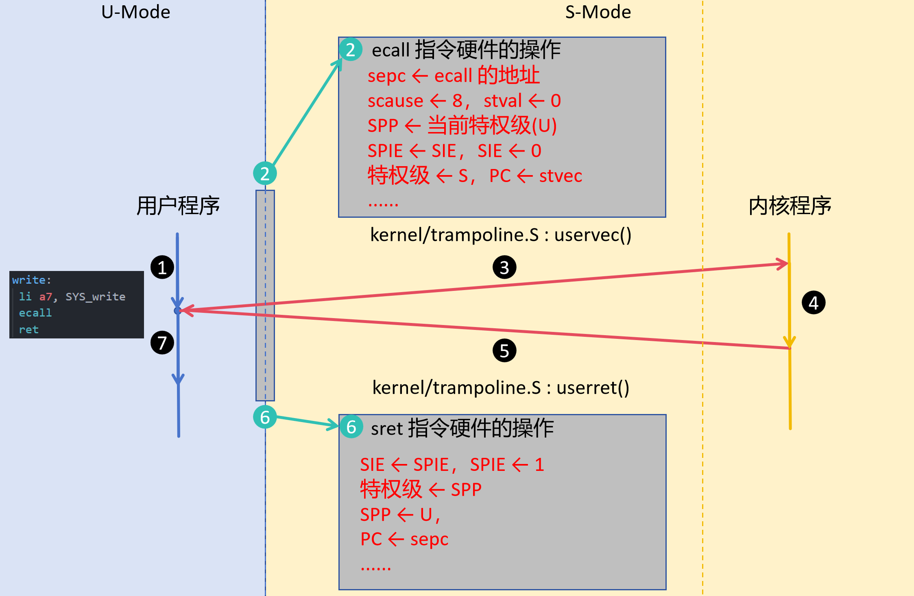
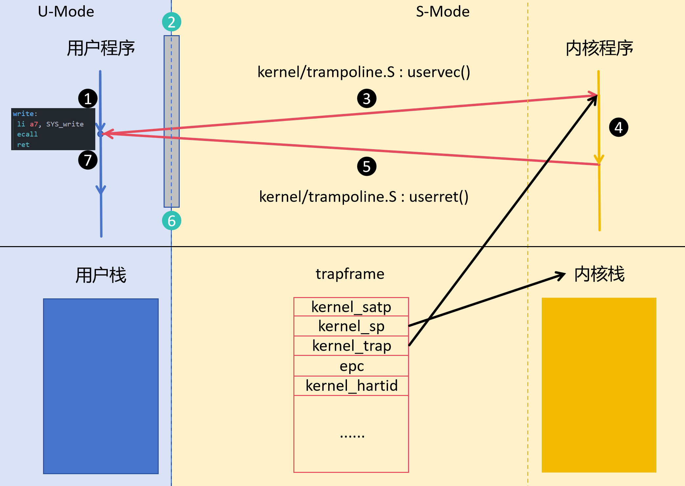

实验三：系统调用、异常处理和中断
=====================================

本实验继续使用前两次实验中的 ``xv6-riscv``。第一部分添加 ``poweroff`` 系统调用：
用户程序请求关机，内核通过 test 设备驱动向 QEMU 写入关机值。第二部分观察并处理异常，
第三部分观察 UART 中断。

在开始实验之前，提交 lab2 分支，合并到 master 分支，并创建新的 lab3 分支：

.. code-block:: sh

   git add .
   git commit -m "lab2 done"
   git checkout master
   git merge lab2
   git checkout -b lab3

.. _lab3-trap:

陷入时硬件做什么
~~~~~~~~~~~~~~~~~~~~~~~~~~~~~~~~~~~~

系统调用通过 ``ecall`` 主动触发**同步异常**；非法指令等异常虽然起因不同，
进入内核时仍经过同一套硬件陷入流程。以下伪码展示异常从 U 模式委托给 S 模式时的关键动作：

.. code-block:: text
   :linenos:

   cause = 异常编号                 // U 模式 ecall 的 cause 为 8
   if (medeleg[cause] == 1) {       // 该异常已委托给 S 模式
       sepc = pc                    // 保存引发异常的指令地址
       scause = cause               // 记录异常原因
       stval = 异常附加信息          // ecall 时为 0
       sstatus.SPIE = sstatus.SIE   // 保存原来的 SIE
       sstatus.SIE = 0              // 进入处理程序时关闭 S 模式中断
       sstatus.SPP = U              // 记录陷入前来自 U 模式
       当前特权级 = S
       pc = stvec.BASE              // 跳到 S 模式陷入入口
   } else {
       进入 M 模式，使用 mepc、mcause、mstatus 和 mtvec
   }

   ``ecall`` 与 ``sret`` 的硬件操作。``ecall`` 将自身地址保存到 ``sepc``；返回前，
   内核已将 ``sepc`` 改为下一条指令的地址。图中的 ②、⑥ 分别标出两次特权级切换。

``medeleg`` 和 ``stvec`` 均在陷入前设置好。硬件不会自动切换页表或内核栈，
也不会保存全部通用寄存器；进入 xv6 后，这些工作由 ``trampoline.S`` 中的
``uservec`` 完成；返回时由 ``userret`` 恢复用户现场并执行 ``sret``。
图中的 ``uservec`` 和 ``userret`` 虽位于不同特权级的交界处，本身都在 S 模式执行。
中断进入 S 模式时也会更新 ``sepc``、``scause`` 和
``sstatus`` 并跳到 ``stvec``；两者在触发条件和返回位置上的区别见第三部分。

.. _lab3-poweroff:

第一部分：添加 poweroff 系统调用
~~~~~~~~~~~~~~~~~~~~~~~~~~~~~~~~~~~~

完成本部分后，应能说清系统调用号、用户态入口、内核分发函数各自的作用，并追踪一次系统调用
从用户程序进入内核的路径。

实现步骤
---------------------

QEMU ``virt`` 机器的 test 设备位于物理地址 ``0x100000``。向其起始位置写入
32 位值 ``0x5555``，QEMU 就会退出。以下代码按 xv6 源码组织；
在已有文件中添加片段，保留原有内容。

映射 test 设备
^^^^^^^^^^^^^^^^^^^^^

在 ``kernel/memlayout.h`` 中定义地址：

.. code-block:: c
   :linenos:
   :caption: kernel/memlayout.h

   #define TESTDEV 0x00100000L

在 ``kernel/vm.c`` 的 ``kvmmake()`` 内、UART 映射附近加入：

.. code-block:: c
   :lineno-start: 29
   :caption: kernel/vm.c 中的 kvmmake()

   // sifive test device
   kvmmap(kpgtbl, TESTDEV, TESTDEV, PGSIZE, PTE_R | PTE_W);

**需要加上这两行。** ``kvmmap`` 将设备所在的一页映射进内核页表；两个地址都写
``TESTDEV``，表示虚拟地址与物理地址相同。内核启用页表后才能访问该寄存器。
映射没有 ``PTE_U`` 权限，用户程序不能直接写它。页表细节留到下一次实验。

实现设备写入
^^^^^^^^^^^^^^^^^^^^^

新增 ``kernel/testdev.c``：

.. code-block:: c
   :linenos:
   :caption: kernel/testdev.c

   #include "types.h"
   #include "param.h"
   #include "memlayout.h"
   #include "riscv.h"
   #include "spinlock.h"
   #include "defs.h"

   #define R(addr) ((volatile uint32 *)(addr))

   static struct spinlock td_lock;

   void
   testdevinit(void)
   {
     initlock(&td_lock, "testdev");
   }

   void
   testwrite(uint32 data)
   {
     acquire(&td_lock);
     *R(TESTDEV) = data;
     while (1) { }
   }

``volatile`` 使设备写入实际发生；写入后等待 QEMU 退出。设备锁沿用 xv6 源码的实现，
本部分不展开锁的机制。在 ``kernel/defs.h`` 添加声明：

.. code-block:: c
   :linenos:
   :caption: kernel/defs.h

   void testdevinit(void);
   void testwrite(uint32 data);

在 ``kernel/main.c`` 的内核初始化代码中调用 ``testdevinit();``，并把
``$K/testdev.o`` 加入 ``Makefile`` 的 ``OBJS`` 列表，否则新文件不会被链接进内核。

接通系统调用
^^^^^^^^^^^^^^^^^^^^^

在 ``kernel/syscall.h`` 定义新的系统调用号。源码中 22 尚未使用，因此写为：

.. code-block:: c
   :linenos:
   :caption: kernel/syscall.h

   #define SYS_poweroff 22

若你的源码已经占用 22，改用一个未使用的编号。在 ``kernel/syscall.c`` 添加函数声明，
并在 ``syscalls`` 数组中添加对应项：

.. code-block:: c
   :linenos:
   :caption: kernel/syscall.c

   extern uint64 sys_poweroff(void);

   // 放在 syscalls[] 初始化列表内
   [SYS_poweroff] = sys_poweroff,

在 ``kernel/sysproc.c`` 实现处理函数：

.. code-block:: c
   :linenos:
   :caption: kernel/sysproc.c

   uint64
   sys_poweroff(void)
   {
     testwrite(0x5555);
     return 0;
   }

``sys_poweroff()`` 只发出关机请求，实际设备写入由 ``testwrite()`` 完成。
正常情况下 QEMU 已退出，``return 0`` 不会执行。

添加用户程序
^^^^^^^^^^^^^^^^^^^^^

在 ``user/user.h`` 声明 ``int poweroff(void);``，在 ``user/usys.pl`` 增加
``entry("poweroff");``。编译时后者生成设置系统调用号并执行 ``ecall`` 的用户态入口，
不要手改生成的 ``user/usys.S``。

新增用户程序：

.. code-block:: c
   :linenos:
   :caption: user/poweroff.c

   #include "kernel/types.h"
   #include "user/user.h"

   int
   main(void)
   {
     poweroff();
     exit(0);
   }

最后将 ``$U/_poweroff\`` 加入 ``Makefile`` 的 ``UPROGS`` 列表。

编译与验证
---------------------

在 xv6-riscv 仓库根目录执行 ``make qemu``。进入 xv6 shell 后，先运行普通命令（如
``ls``）确认系统仍正常；再运行：

.. code-block:: sh

   $ poweroff

预期现象是 QEMU 退出，终端返回 Ubuntu shell，而不是 xv6 的 ``$`` 提示符。
重新执行 ``make qemu`` 应仍能正常启动 xv6。若出现 ``unknown sys call``，检查系统
调用号、用户入口和分发表；若发生地址访问异常，检查设备地址与内核页表映射；若编译
提示找不到 ``testwrite``，检查 ``kernel/defs.h`` 和 ``$K/testdev.o``；若提示
``poweroff`` 不存在，检查 ``UPROGS``。

.. raw:: html

   

      
完成系统调用并记录结果

      
提交上述修改的代码、<code>poweroff</code> 使 QEMU 退出的终端截图，
      并在实验报告中说明各文件在调用链中的作用。

   

串起调用路径
---------------------

在 ``user/usys.pl`` 生成的入口中，``poweroff()`` 将系统调用号放入寄存器 ``a7``，
再执行 ``ecall``。它会触发“来自 U 模式的环境调用”异常，而不是普通函数调用。
结合开头的硬件流程，以及 ``kernel/trampoline.S``、``kernel/trap.c`` 和
``kernel/syscall.c``，追踪这次系统调用：

.. code-block:: text

   user/poweroff.c: poweroff()
     -> 用户态入口：将 SYS_poweroff 放入 a7，执行 ecall
     -> 硬件：记录异常信息，切到 S 模式并跳至 stvec
     -> trampoline.S: uservec 保存寄存器、切换内核页表和内核栈
     -> trap.c: usertrap() 识别来自用户态的系统调用
     -> syscall.c: syscall() 读取 a7，调用 sys_poweroff()
   -> sysproc.c: sys_poweroff() 调用 testwrite(0x5555)
   -> testdev.c: 在内核态向 test 设备写入 0x5555

   以 ``write`` 为例的完整系统调用路径：① 用户态执行 ``ecall``；② 硬件陷入
   S 模式；③ ``uservec`` 保存寄存器、切换内核栈和页表并进入内核；④ 内核处理
   系统调用；⑤ 经 ``userret`` 恢复用户现场；⑥ ``sret`` 返回 U 模式；⑦ 用户态
   入口继续执行 ``ret``。图中的 ``trapframe`` 与内核栈是两块不同的内存。

``sepc`` 指向 ``ecall`` 本身，所以 ``usertrap()`` 会将保存的返回地址加 4。
通常，内核会把系统调用的返回值写入保存的 ``a0``，经 ``prepare_return()`` 和
``trampoline.S`` 中的 ``userret`` 执行 ``sret``，回到 ``ecall`` 之后的用户态指令。
``poweroff`` 的进入路径相同，但成功时 QEMU 已退出，因此观察不到图中的⑤至⑦。
请阅读现有的
``getpid`` 系统调用，说明它如何沿同一路径返回用户程序，以及为什么 ``poweroff``
成功后不会打印“调用已返回”的信息。

.. _lab3-exception:

第二部分：观察和处理异常
~~~~~~~~~~~~~~~~~~~~~~~~~~~~~~~~~~~~

系统调用是程序主动请求内核服务；缺页和非法指令也会使 CPU 陷入内核，但需要按不同的
``scause`` 处理。本部分先观察非法访存，再通过非法指令异常模拟一条返回 hart ID 的
自定义指令，并观察陷入时保存的用户现场。

观察缺页异常
---------------------

新建 ``user/fault.c``，分别尝试读取和写入 xv6 未映射的用户地址：

.. code-block:: c
   :linenos:
   :caption: user/fault.c

   #include "kernel/types.h"
   #include "user/user.h"

   int
   main(int argc, char *argv[])
   {
      volatile int *bad = (volatile int *)0x40000000L;
      printf("before fault\n");

      if (argc > 1 && argv[1][0] == 'w') 
         *bad = 1;
      else if (argc > 1 && argv[1][0] == 'r')
         printf("value=%d\n", *bad);
      
      printf("after fault\n");
      exit(0);
   }

将 ``$U/_fault`` 加入 ``Makefile`` 的 ``UPROGS``，编译启动后分别运行
``fault r`` 和 ``fault w``。在源码中，这个地址超出进程的有效范围，现有
``vmfault()`` 无法为其补页。观察 ``usertrap()`` 打印的 ``scause``、``sepc``、
``stval``：读缺页对应 13（``0xd``），写缺页对应 15（``0xf``），``stval`` 是发生访问的地址。
``sepc`` 指向触发异常的指令，而不是下一条指令。出错进程退出后，xv6 shell 应仍能运行；
``after fault`` 不应出现。

这与 Unix 系统常见的“段错误”现象相似。

实现 ``gethartid`` 自定义指令
-------------------------------

规定 32 位指令 ``0x0000000b`` 的功能为：将当前 hart ID 写入 ``a0``。它使用 RISC-V
的 ``custom-0`` 操作码；课程使用的 QEMU 未实现这条指令时，执行它应产生非法指令异常
（``scause == 2``），请先观察验证。新建 ``user/gethartid.c``：

.. code-block:: c
   :linenos:
   :caption: user/gethartid.c

   #include "kernel/types.h"
   #include "user/user.h"

   int
   main(void)
   {
     int hartid;

     asm volatile(".word 0x0000000b\n\tmv %0, a0"
                  : "=r"(hartid)
                  :
                  : "a0", "memory");
     printf("hartid=%d\n", hartid);
     exit(0);
   }

``.word`` 放入一条 4 字节指令；返回后，``mv`` 从 ``a0`` 取出模拟执行的结果。
把 ``$U/_gethartid`` 加入 ``Makefile`` 的 ``UPROGS``。

**为什么要用 copyin()？** 硬件保存的 ``sepc`` （随后复制到
``p->trapframe->epc`` ）是出错指令的 **用户虚拟地址**。 ``uservec`` 在调用
``usertrap()`` 前已切换到内核页表，因此内核不能把这个地址强制转换成指针并直接
解引用：那会按内核页表解释该地址，可能读不到原来的用户指令。
``kernel/vm.c`` 中的 ``copyin(pagetable, dst, srcva, len)`` 接收进程的用户页表，
通过 ``walkaddr()`` 找到用户页对应的物理内存，检查用户访问权限，再把指定字节复制到
内核变量；若无法读取则返回 ``-1``。它还会按页处理跨页读取。本实验传入
``p->pagetable``、内核中用于保存指令的变量地址、``p->trapframe->epc`` 和长度 4，
随后比较读出的指令编码。

在 ``kernel/trap.c`` 的 ``usertrap()`` 中，在系统调用分支之后、``devintr()`` 之前
增加识别 ``scause == 2`` 的分支。非法指令不一定是本实验的指令：用 ``copyin()`` 从
当前进程用户页表中读取 ``p->trapframe->epc`` 指向的 4 字节，只有编码等于
``0x0000000b`` 时才模拟执行；读取失败或编码不匹配时，仍按未知异常终止进程。
``stval`` 在非法指令异常时不保证提供指令编码，因此不要仅凭它识别指令。

参考 ``kernel/proc.h`` 的 ``struct trapframe``，打印 ``epc`` 及保存的用户寄存器
``ra``、``sp``、``gp``、``tp``、``t0``--``t6``、``s0``--``s11``、
``a0``--``a7``。``x0`` 恒为零，不保存在 ``trapframe`` 中；``kernel_*`` 字段是内核
返回所需的信息，不是用户寄存器。然后调用 ``cpuid()`` 取得当前 hart ID，将结果写入
``p->trapframe->a0``，并将 ``p->trapframe->epc`` 加 4，再沿现有路径返回用户态。
此处尚未开启中断，符合 ``cpuid()`` 的调用要求。运行 ``gethartid`` 时，应看到寄存器
快照及 ``hartid=...``；若忘记更新 ``epc``，同一条指令会反复触发异常。

请对照 ``kernel/start.c``：启动时，内核把 ``mhartid`` 保存到内核态的 ``tp``，
``cpuid()`` 从这里读取 hart ID。``trapframe->tp`` 保存的是用户态 ``tp``，不能
直接把它当作 hart ID。模拟指令修改的是保存的 ``a0``，返回用户态后才成为程序看到的
寄存器值。多核运行时，这个值只表示本次指令执行时所在的 hart，并非进程固定编号。

为什么要保存现场
---------------------

陷入时硬件保存了 ``sepc`` 等控制信息，却不会自动保存全部通用寄存器。
``trampoline.S`` 的 ``uservec`` 先把用户寄存器写入当前进程的 ``trapframe``，
之后内核代码及 ``printf`` 才能使用这些寄存器而不丢失原值。返回时，
``prepare_return()`` 根据 ``trapframe->epc`` 设置 ``sepc``，``userret`` 从
``trapframe`` 恢复用户寄存器并执行 ``sret``。请对照 ``uservec`` 和 ``userret``
中保存、恢复 ``a0`` 的指令，解释为什么 ``a0`` 要先暂存在 ``sscratch``，以及若
不保存用户寄存器，``gethartid`` 返回后程序可能出现什么问题。这里的用户陷入现场
也不要与 ``struct context`` 混淆：后者用于内核线程的上下文切换。

.. raw:: html

   

      
必做：实现 gethartid 自定义指令

      <ol>
         <li>编写 <code>user/gethartid.c</code>，执行编码为
         <code>0x0000000b</code> 的指令，并从 <code>a0</code> 取得、打印
         hart ID；将程序加入 <code>Makefile</code> 的 <code>UPROGS</code>。</li>
         <li>在 <code>usertrap()</code> 中识别 <code>scause == 2</code>，用
         <code>copyin()</code> 读取 <code>epc</code> 处的 4 字节指令。
         只有编码匹配时才处理；读取失败或遇到其他非法指令时，终止出错进程。</li>
         <li>处理该指令时，打印 <code>epc</code> 及
         <code>trapframe</code> 中保存的用户通用寄存器（不含恒为零的
         <code>x0</code>）；调用
         <code>cpuid()</code>，将结果写入 <code>trapframe-&gt;a0</code>，
         再将 <code>trapframe-&gt;epc</code> 加 4，使用户程序从下一条指令继续执行。</li>
         <li>运行 <code>gethartid</code>，提交修改的代码，以及能同时看清内核
         寄存器快照和用户程序 <code>hartid=...</code> 输出的截图。报告中说明
         为什么要修改保存的 <code>a0</code> 和 <code>epc</code>，以及
         <code>trapframe-&gt;tp</code> 为什么不能直接作为 hart ID。</li>
      </ol>
   

.. _lab3-interrupt:

第三部分：观察 UART 中断
~~~~~~~~~~~~~~~~~~~~~~~~~~~~~~~~~~~~

UART 不会等用户程序执行某条指令才报告输入。键盘输入到达后，QEMU 的 UART 向 PLIC
发出 IRQ 10；PLIC 向 CPU 报告 S 模式外部中断。以下先假设中断到来时，CPU 正在
U 模式执行一个用户程序。

用 GDB 观察 UART 中断
---------------------

首先在 kernel/trap.c 的 uartintr() 函数入口打断点，然后开启 vscode 调试，xv6 会多次进入 uartintr()，
你可以观察 qemu 的终端输出，还没有到 xv6 shell 时，你可以继续运行调试 (F5)，直到 xv6 shell 输出 $ 提示符后，
在shell 中输入任意字符，UART 会产生中断，CPU 会进入 uartintr()。

如何进入 ``uartintr()``
-------------------------------

#. UART 发出请求，PLIC 将外部中断报告给 CPU。在 xv6 已启用中断并通过
   ``mideleg`` 将它委托给 S 模式的前提下，CPU 在可响应中断的指令边界接收该请求。
#. 异常处理程序发现 ``scause`` 不是系统调用编号 8，转而调用 ``devintr()``。
   ``devintr()`` 识别编号 9 的外部中断后调用 ``plic_claim()``，得到 PLIC 的
   中断源编号 10，即 ``UART0_IRQ``；随后调用 ``uartintr()`` 读取输入，
   并通过 ``plic_complete(UART0_IRQ)`` 告诉 PLIC 已处理完毕 UART 中断。
#. ``devintr()`` 返回后，中断并非由某条用户指令主动触发，因此无需像 ``ecall`` 或本实验的
   ``gethartid`` 那样把 ``trapframe->epc`` 加 4。

如果中断到来时 CPU 已在 S 模式执行内核代码，硬件通过 ``kernelvec``，
然后进入 ``kerneltrap()``；它同样调用 ``devintr()``，而 **不会经过
``uservec`` 和 ``usertrap()``**。

异常与中断的硬件差别
---------------------

两者进入 S 模式后的基本动作相同：硬件保存 ``sepc``，写入 ``scause``，更新
``sstatus.SPP/SPIE/SIE``，切到 S 模式并跳转到 ``stvec``；寄存器、页表和内核栈
仍由软件按需保存和切换。关键差别是：

.. list-table:: 异常和中断对照
   :header-rows: 1
   :widths: 25 36 39

   * - 项目
     - 同步异常（以 ``gethartid`` 为例）
     - 异步中断（以 UART 为例）
   * - 触发时机
     - 执行引发异常的指令时发生。
     - 设备在程序之外提出请求；CPU 在可响应中断时接收。
   * - 响应条件与委托
     - 不受中断使能位屏蔽；``medeleg`` 决定是否委托给 S 模式。
     - 须有待处理中断和相应使能；``mideleg`` 决定是否委托给 S 模式。
   * - ``scause``
     - 最高位为 0，低位是异常编号；本实验的非法指令异常为 2。
     - 最高位为 1，低位是中断编号；S 模式外部中断为 9。
   * - ``sepc`` 与返回
     - 指向触发异常的指令；本实验模拟 4 字节指令后加 4。
     - 保存恢复执行的位置；处理完 UART 后从该位置继续，不人为加 4。

思考题
~~~~~~~~~~~~~~~~~~~~~

回答时请结合本实验的运行结果和对应源码，区分硬件、``trampoline.S`` 与内核 C 代码
各自完成的工作。

#. **同一入口，不同结局。** 对比 ``poweroff``、``gethartid``、``fault r`` 和
   用户态运行时到来的 UART 中断：它们分别由什么触发，``scause`` 如何区分，
   ``usertrap()`` 最终会返回用户态、终止进程，还是使 QEMU 退出？哪些路径需要
   将保存的 ``epc`` 加 4，为什么？
#. **三种现场。** 陷入前后，用户栈指针保存在哪里，内核从哪里取得内核栈指针？
   ``trapframe``、内核栈和 ``struct context`` 各保存什么？假设 ``uservec``
   不保存用户寄存器就调用 ``usertrap()``，为何仅靠硬件写入的 ``sepc`` 仍无法正确
   返回用户程序？
#. **辨认一条陌生指令。** ``gethartid`` 触发异常后，为什么不能直接解引用
   ``sepc``，也不能仅凭 ``stval`` 或 ``scause == 2`` 就认定它是本实验的指令？
   如果把所有非法指令都当作 ``gethartid`` 并跳过，程序出错时会产生什么后果？
#. **返回地址改错了。** 假设开发者为了“统一处理”，让 ``usertrap()`` 在每次
   陷入后都把保存的 ``epc`` 加 4。分别分析这对系统调用、自定义指令和 UART
   中断的影响。对于本实验中会被终止的缺页进程，错误加 4 是否立刻可见？如果
   将来实现补页后返回，又会怎样？
#. **两级中断编号。** UART 中断发生在 U 模式和 S 模式时，分别经过哪些入口，
   最终在哪里汇合？说明 ``scause`` 中的 9 与 ``plic_claim()`` 返回的 10 分别
   标识什么。如果处理完输入却不调用 ``plic_complete()``，后续中断处理可能受到
   什么影响？
#. **换一种接口。** 如果把 ``gethartid`` 改成普通系统调用，用户程序、内核分发
   和返回值路径需要怎样变化？与通过非法指令异常模拟相比，哪一种更适合作为面向
   普通程序的长期接口？从硬件支持、可移植性和异常处理职责三个角度说明理由。

参考：`xv6-riscv 源码 <https://github.com/mit-pdos/xv6-riscv>`_；
`RISC-V 非特权级规范 <https://riscv.github.io/riscv-isa-manual/snapshot/spec/#vol:unpriv>`_；
`RISC-V 特权级规范 <https://riscv.github.io/riscv-isa-manual/snapshot/spec/#vol:priv>`_；
`QEMU test 设备行为 <https://github.com/qemu/qemu/blob/master/hw/misc/sifive_test.c>`_。
